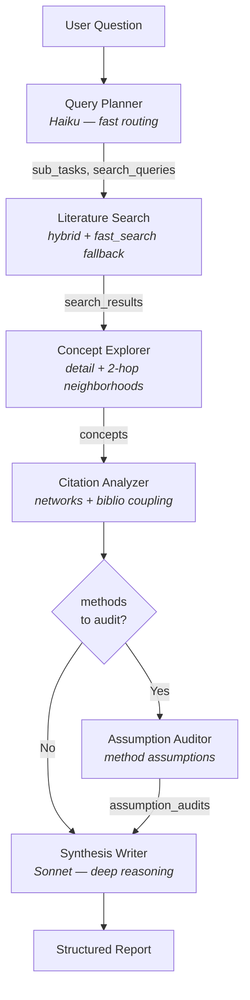
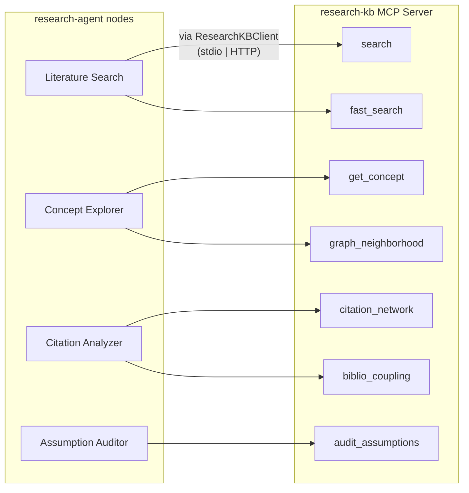

# research-agent

[](https://github.com/brandonmbehring-dev/research-agent/actions/workflows/ci.yml)
[](https://python.org)
[](LICENSE)
[](https://docs.astral.sh/ruff/)

Multi-agent research analysis system powered by [LangGraph](https://github.com/langchain-ai/langgraph) and the [Model Context Protocol (MCP)](https://modelcontextprotocol.io/).

Given a research question, the agent decomposes it into sub-tasks, searches a knowledge base, explores concept graphs, analyzes citation networks, audits method assumptions, and produces a structured synthesis report.

**Project History:** This repository is an open-source extraction of a multi-agent research workflow developed for internal use. It was modularized, upgraded with strict typing and evals, and published in February 2026 to demonstrate LangGraph + MCP orchestration patterns.

## Architecture

### Pipeline Flow



### MCP Tool Mapping



### Design Decisions

1. **LangGraph over CrewAI/Agent SDK** — Vendor-agnostic, fine-grained state control, conditional routing, proven in production across multiple personal projects.

2. **MCP integration over direct DB calls** — Standard protocol decouples the agent from the knowledge backend. research-kb can be swapped for any MCP-compatible source.

3. **Separate agent from knowledge base** — Single responsibility: agent orchestrates, KB serves knowledge. Services scale independently.

4. **Provider-agnostic model dispatch** — `create_llm()` wraps LangChain's `init_chat_model`, auto-resolving provider from model name. Defaults to Haiku for planning and Sonnet for synthesis. Override with any supported provider prefix (e.g., `ollama/`, `openai/`).

5. **Pydantic BaseModel state** — Richer type support with defaults on every field, validation, and frozen immutability for sub-models. Each node returns a partial dict of updates — LangGraph merges automatically.

6. **Auditable Logic over Prompt Chaining** — Conditional routing ensures the LLM doesn't hallucinate methodological assumptions; it explicitly audits them against the knowledge graph. This provides a deterministic, verifiable research pipeline.

## Built on research-kb

This agent consumes [research-kb](https://github.com/brandonmbehring-dev/research-kb), a production knowledge base system I built with:

- **478 sources** in causal inference, time series, and RAG/LLM literature
- **307K+ concepts** in a knowledge graph with typed relationships
- **4-signal hybrid search**: BM25 full-text + BGE-large vectors + graph signals + PageRank citation authority
- **20 MCP tools** for search, concept exploration, citation analysis, and assumption auditing
- **~2,100+ tests** with comprehensive CI/CD

The agent uses 7 of these tools:

| Tool | Purpose |
|------|---------|
| `research_kb_search` | Hybrid search (BM25 + vector + graph + PageRank) |
| `research_kb_fast_search` | Lightweight vector-only fallback (~200ms) |
| `research_kb_get_concept` | Retrieve concept details from knowledge graph |
| `research_kb_graph_neighborhood` | Explore related concepts within N hops |
| `research_kb_citation_network` | Find citing/cited-by chains |
| `research_kb_biblio_coupling` | Related papers via shared reference overlap |
| `research_kb_audit_assumptions` | Method assumption documentation |

## Quickstart

### Prerequisites

- Python 3.11+
- [research-kb](https://github.com/brandonmbehring-dev/research-kb) cloned and set up locally
- Anthropic API key

### Installation

```bash
git clone https://github.com/brandonmbehring-dev/research-agent.git
cd research-agent

# Option A: uv (recommended — matches CI)
uv sync --extra dev

# Option B: pip
python -m venv venv
source venv/bin/activate
pip install -e ".[dev]"
```

### Configuration

```bash
cp .env.example .env
# Edit .env with your API key and research-kb path
```

**Environment variables:**

| Variable | Default | Description |
|----------|---------|-------------|
| `ANTHROPIC_API_KEY` | *(required)* | Anthropic API key |
| `MCP_TRANSPORT` | `stdio` | `stdio` (local) or `http` (Docker) |
| `RESEARCH_KB_PATH` | | Path to research-kb repo (stdio mode) |
| `RESEARCH_KB_URL` | `http://research-kb:8000` | HTTP endpoint (Docker mode) |
| `RESEARCH_KB_PYTHON` | | Python executable for stdio transport (default: `{RESEARCH_KB_PATH}/venv/bin/python`) |
| `MCP_PATH` | `/mcp` | MCP endpoint path appended to HTTP URL |
| `CACHE_ENABLED` | `true` | Enable SQLite report cache |
| `CACHE_DB_PATH` | `~/.cache/research-agent/cache.db` | Path to SQLite cache database |
| `CACHE_TTL_HOURS` | `24` | Hours before cached reports expire |

### Custom LLM Providers

The agent uses LangChain's `init_chat_model` for provider-agnostic model dispatch.
Model strings like `claude-sonnet-4-6` auto-resolve to Anthropic.
To use a different provider, set the model env vars with a provider prefix and install
the corresponding LangChain integration:

```bash
export PLANNING_MODEL=ollama/llama3
export SYNTHESIS_MODEL=openai/gpt-4o
pip install langchain-ollama  # or langchain-openai
```

See [LangChain chat model integrations](https://python.langchain.com/docs/integrations/chat/) for the full list of 20+ supported providers.

### Run

```bash
# CLI (stdio transport — spawns research-kb subprocess)
research-agent "What are the assumptions of double machine learning?"

# With verbose logging
research-agent -v "Compare DML and instrumental variables"

# Stream progress to stderr as nodes complete
research-agent --stream "What are the assumptions of DML?"

# Save report to file
research-agent -o report.md "How does cross-fitting reduce bias?"

# Bypass cache for a fresh run
research-agent --no-cache "What are the assumptions of DML?"

# Clear all cached reports
research-agent --clear-cache
```

### Docker (HTTP transport)

```bash
docker-compose up
# Agent connects to research-kb via HTTP at http://research-kb:8000/mcp
docker-compose run agent "Query here"
```

## Demo

```bash
research-agent "What are the assumptions of double machine learning?"
```

The agent runs six pipeline stages:

1. **Query Planner** (Haiku) decomposes the question into 4-5 sub-tasks
2. **Literature Search** runs hybrid search across 478 sources (~12 results)
3. **Concept Explorer** traverses the knowledge graph (DML, Neyman orthogonality)
4. **Citation Analyzer** maps citation networks + bibliographic coupling
5. **Assumption Auditor** documents method assumptions from the KB
6. **Synthesis Writer** (Sonnet) produces a structured report with citations

Total time: ~3 minutes. Output: ~15K char report with 7 sections.

<details>
<summary>Full report output</summary>

```markdown
# Research Report

## Executive Summary

Double Machine Learning (DML) is a causal inference framework that combines Neyman orthogonality and sample-splitting (cross-fitting) to enable valid inference on low-dimensional structural parameters even when high-dimensional nuisance functions are estimated via machine learning. The core assumptions span identification (conditional independence, common support), estimation (nuisance convergence rates), and robustness (Neyman orthogonality/score debiasing). Evidence from the knowledge base is moderately strong for the theoretical foundations but sparse on some sub-assumptions, particularly cross-fitting and conditional independence, which were not directly resolved in the KB's assumption audit.

## Key Findings

- **Neyman Orthogonality is the central debiasing assumption.** DML requires that the score function used to identify the structural parameter θ₀ satisfies a Neyman orthogonality condition — i.e., the Gateaux derivative of the moment condition with respect to nuisance parameters equals zero at the true values. This ensures that first-order perturbations in nuisance estimates do not bias inference on θ₀. [Chernozhukov et al. (2018), Source: 2bc757a2; Syrgkanis et al. (2021), Source: 1040a93d; Foster & Syrgkanis (2019), Source: 70e6eeef]
- **Nuisance parameter convergence rates must satisfy a product-rate condition.** DML requires that the estimation errors of the nuisance functions (e.g., E[Y|X] and E[T|X]) converge fast enough so that their product is o(n^{-1/2}). This allows the plug-in ML estimates to not contaminate the √n-consistent inference on θ₀. Specifically, if each nuisance achieves rate n^{-1/4}, their product achieves n^{-1/2}. [Chernozhukov et al. (2018), Source: 2bc757a2; Mackey et al. (2017), Source: d84d40f7]
- **Sample splitting / cross-fitting is required to avoid overfitting bias.** DML uses K-fold cross-fitting: nuisance models are trained on a complement fold and applied to the held-out fold. This eliminates the regularization bias that would arise from using the same data for both nuisance estimation and moment evaluation. Without cross-fitting, the orthogonality condition alone is insufficient to guarantee valid inference. [Chernozhukov et al. (2018), Source: 2bc757a2; Syrgkanis et al. (2021), Source: 1040a93d]
- **Conditional independence (unconfoundedness) is a critical identification assumption.** DML assumes that, conditional on observed covariates X, the treatment T is independent of potential outcomes — i.e., there are no unobserved confounders. This is the standard selection-on-observables assumption and is not testable from data alone. [Source: 69fdbfbe; Source: 82f50a9c; Interview Prep vol2, Source: 198fd113]
- **Common support (overlap) is required for reliable estimation.** The treated and control populations must have overlapping covariate distributions so that propensity scores are bounded away from 0 and 1. Violations lead to extreme inverse-probability weights and unstable estimates. [Assumption Audit, Source: e076970f-ceb5-4b9b-8e29-3e641e96c08e]
- **The mean-zero condition on the score residual is required.** The moment condition E[ψ(W; θ₀, η₀)] = 0 must hold at the true parameter and nuisance values, where ψ is the orthogonal score. This is the identification equation from which θ₀ is recovered. [Assumption Audit, Source: e076970f; Chernozhukov et al. (2018), Source: 2bc757a2]
- **Strong convexity (or local identifiability) of the population risk is required.** The population objective must be strongly convex (or at minimum locally identified) with respect to θ₀ near the true value, ensuring that the moment condition has a unique solution and that the estimator is well-defined. [Assumption Audit, Source: e076970f; Foster & Syrgkanis (2019), Source: 70e6eeef]
- **The true parameter θ₀ must be in the interior of the parameter space Θ.** DML requires θ₀ to be sufficiently separated from the boundary of Θ to ensure standard asymptotic normality. Boundary cases require modified inference procedures. [Chernozhukov et al. (2018), Source: 2bc757a2]
- **Higher-order orthogonality may be needed when nuisance rates are slow.** When ML estimators achieve only slow convergence rates (e.g., k-th order smoothness), standard (first-order) Neyman orthogonality may be insufficient. Higher-order orthogonal corrections of order k can achieve rates of n^{-1/(2k+2)}, extending DML to harder nonparametric settings. [Mackey et al. (2017), Source: d84d40f7]
- **DML connects to the Frisch-Waugh-Lovell (FWL) theorem.** The DML estimator for a linear treatment effect can be understood as regressing residualized outcomes Ỹ = Y − Ê[Y|X] on residualized treatment T̃ = T − Ê[T|X], which is the ML analog of the FWL partialling-out theorem. This provides intuition for why orthogonalization removes confounding bias. [Interview Prep vol2, Source: 198fd113]

## Concept Map

**Core Identification Layer**
- Unconfoundedness (Conditional Independence) → enables causal interpretation of θ₀
- Common Support (Overlap) → ensures propensity scores are bounded; required for stable weighting
- Mean-Zero Score Condition → E[ψ(W; θ₀, η₀)] = 0 defines θ₀

**Debiasing / Orthogonality Layer**
- Neyman Orthogonality → ∂_η E[ψ] = 0 at true values; makes score insensitive to nuisance perturbations
  ↳ Connects to: FWL Theorem (residualization interpretation), Doubly Robust Estimation
  ↳ Extends to: Higher-Order Orthogonality (when nuisance rates are slow)

**Estimation / Regularity Layer**
- Nuisance Convergence Rates (product rate o(n^{-1/2})) → controls bias from ML plug-in
- Cross-Fitting / Sample Splitting → eliminates overfitting bias; enables use of complex ML models
- Strong Convexity of Population Risk → ensures unique identification of θ₀
- Interior of Parameter Space (θ₀ ∉ boundary Θ) → ensures standard asymptotic normality

**Connections Between Layers**
- Neyman Orthogonality + Nuisance Convergence Rates → together guarantee √n-consistent, asymptotically normal θ̂
- Cross-Fitting + Orthogonality → together eliminate both regularization bias and overfitting bias
- Unconfoundedness + Common Support → together enable nonparametric identification of the causal parameter
- FWL Theorem → intuitive bridge between classical OLS partialling-out and DML residualization

## Citation Landscape

**Seminal / Foundational Papers**
- Chernozhukov, Chetverikov, Demirer, Duflo, Hansen, Newey, Robins (2018). *Double/Debiased Machine Learning for Treatment and Structural Parameters.* The Econometrics Journal. [Source: 2bc757a2] — This is the primary reference establishing DML, Neyman orthogonality, cross-fitting, and convergence rate requirements. It is the most directly relevant source in the KB.

**Theoretical Extensions**
- Mackey, Syrgkanis, Zadik (2017). *Orthogonal Machine Learning: Power and Limitations.* [Source: d84d40f7] — Extends DML to higher-order orthogonality, characterizing the limits of the approach when nuisance rates are slow (rate n^{-1/(2k+2)}).
- Foster & Syrgkanis (2019). *Orthogonal Statistical Learning.* [Source: 70e6eeef] — Generalizes orthogonal learning to a broader statistical learning framework; introduces strong convexity requirements.

**Applied / Algorithmic Extensions**
- Syrgkanis et al. (2021). *Double Machine Learning with Gradient Boosting and Its Application to Dynamic Causal Effects.* [Source: 1040a93d] — Demonstrates DML with gradient boosting; reinforces the role of Neyman orthogonality and sample splitting in practice.
- Nie & Wager (2020). *Optimal Doubly Robust Estimation of Heterogeneous Causal Effects.* [Source: 83da1ed9] — Applies DML-style orthogonalization to heterogeneous treatment effect estimation (R-learner).

**Pedagogical / Applied Sources**
- Manning Causal Inference Data Science (2024) [Source: 82f50a9c] and Causal Inference for Data Science [Source: 69fdbfbe] — Textbook-level treatments of DML assumptions.
- Interview Prep vol2 [Source: 198fd113] — Provides the FWL-to-DML conceptual bridge.
- Interview Prep vol1 [Source: 1dec577d] — Defines Neyman orthogonality in accessible terms.

**Tangentially Related**
- Meta-learners paper [Source: a24af953] — Related HTE estimation context but low direct relevance to DML assumptions.
- Time Series Analysis (1994) [Source: 24fe0e16] — Orthogonality conditions in a GMM/time-series context; low relevance.
- Causal AI / Causal Artificial Intelligence (2024) [Sources: 546b1d2e, 2640f892] — General causal hierarchy; minimal direct relevance to DML assumptions.

## Methodological Considerations

1. **Untestable identification assumptions**: Unconfoundedness (conditional independence) and the exclusion of unobserved confounders cannot be verified from data. Researchers must rely on domain knowledge and sensitivity analyses (e.g., Rosenbaum bounds) to assess plausibility.

2. **Nuisance rate verification**: The product-rate condition (each nuisance at n^{-1/4}) is a theoretical requirement. In practice, whether a given ML model achieves this rate depends on the true smoothness/sparsity of the nuisance functions, which is unknown. Practitioners should use flexible, well-regularized models (e.g., lasso, random forests, gradient boosting) and report robustness checks.

3. **Cross-fitting implementation**: The number of folds K affects finite-sample performance. K=5 or K=10 is standard. The KB confirms cross-fitting is required but does not provide detailed guidance on fold selection.

4. **Boundary parameter issues**: The assumption that θ₀ is in the interior of Θ is standard but may be violated in constrained problems (e.g., non-negative treatment effects). Modified inference is needed in such cases.

5. **Assumption audit limitations**: The KB's assumption audit for DML returned some assumptions (parallel trends, geography control) that are not universal DML assumptions, indicating noise in the KB's structured data layer.

6. **Knowledge graph sparsity**: The KG showed only 1 connected concept for both DML and Neyman orthogonality nodes, with 0 explicit relationships encoded. This limits automated concept traversal and suggests the KB's graph layer is underdeveloped for this topic.

## Gaps & Limitations

1. **Cross-fitting assumptions not formally audited**: The KB's assumption audit did not return a dedicated entry for the cross-fitting/sample-splitting procedure. Its role is inferred from the literature results (Sources: 2bc757a2, 1040a93d) rather than a structured KB entry.

2. **Conditional independence not in assumption audit**: Despite being the most fundamental identification assumption, unconfoundedness was not returned as a formal KB assumption for DML. It appears only in textbook sources (Sources: 69fdbfbe, 82f50a9c) and interview prep materials.

3. **No coverage of instrument-based DML**: DML with instrumental variables (IV-DML) has its own additional assumptions (relevance, exclusion restriction). The KB touched on this tangentially (citation network mentions "Machine Learning Estimation of Heterogeneous Treatment Effects with Instruments") but did not provide detailed assumption coverage.

4. **Finite-sample behavior underexplored**: The KB evidence is largely asymptotic. Finite-sample guarantees, the impact of model misspecification, and behavior under weak overlap are not well-covered.

5. **Parallel trends assumption listed as DML assumption**: The assumption audit returned "parallel trends" as a critical DML assumption, which is specific to difference-in-differences settings, not DML in general. This suggests the KB conflates DML applied in DiD contexts with DML's core assumptions — a potential KB quality issue.

6. **Geography control assumption**: Similarly, the "weaker assumption about geography control" returned in the audit is clearly application-specific (likely from an empirical paper using DML) and not a general DML assumption. This reduces the reliability of the automated assumption audit for this query.

7. **No coverage of model selection / regularization assumptions**: DML implicitly assumes that the ML models used for nuisance estimation are appropriately regularized and that model selection does not introduce additional bias. This is not addressed in the KB.

## Confidence Assessment

**Level**: medium

The seminal Chernozhukov et al. (2018) paper is present in the KB and directly addresses the core theoretical assumptions of DML, providing high confidence for the Neyman orthogonality, convergence rate, cross-fitting, and interior-of-parameter-space assumptions. Supporting theoretical papers (Mackey et al. 2017, Foster & Syrgkanis 2019) corroborate and extend these findings. However, confidence is reduced to medium overall for three reasons: (1) the KB's automated assumption audit returned several application-specific assumptions (parallel trends, geography control) that are not universal DML assumptions, indicating noise in the KB's structured data layer; (2) the knowledge graph is very sparse (0 relationships encoded for both DML and Neyman orthogonality nodes), limiting graph-based verification; and (3) the most fundamental identification assumption (unconfoundedness/conditional independence) was not formally captured in the KB's assumption audit, requiring inference from secondary sources. The core theoretical findings are well-supported, but practitioners should consult Chernozhukov et al. (2018) directly for formal proofs.
```

</details>

## Example Queries

The agent handles any research topic in the knowledge base. Examples:

```
"What are the assumptions of double machine learning?"
"Compare instrumental variables and regression discontinuity designs"
"How does cross-fitting reduce regularization bias in semiparametric estimation?"
"What methods exist for heterogeneous treatment effect estimation?"
"Explain the relationship between propensity scores and inverse probability weighting"
```

If results are sparse for a topic, the synthesis report honestly identifies gaps:

> *"2 sources found on [topic]. The knowledge base has deeper coverage on causal inference methods — consider refining the query to focus on [related area]."*

## Testing

```bash
# Unit tests (default, no env vars needed — all MCP calls mocked)
pytest tests/ -v --cov=research_agent --cov-fail-under=80

# Integration tests (requires live research-kb + API key)
RESEARCH_KB_PATH=~/Claude/research-kb ANTHROPIC_API_KEY=sk-... \
    pytest tests/ -m integration -v

# Evals (separate, LLM-as-judge — see docs/eval_baselines.md)
pytest evals/ -m eval --timeout=120 -v

# Run specific test module
pytest tests/test_nodes.py -v
```

## Project Structure

```
src/research_agent/
├── __init__.py
├── graph.py              # LangGraph StateGraph + conditional edges
├── state.py              # Pydantic state schema
├── config.py             # Model selection, MCP endpoint config
├── cache.py              # SQLite report cache (query hash + TTL)
├── mcp_client.py         # Thin wrapper calling research-kb MCP tools
├── cli.py                # CLI entry point
└── nodes/
    ├── query_planner.py      # Decomposes question into sub-tasks
    ├── literature_search.py  # Hybrid search with fallback
    ├── concept_explorer.py   # Knowledge graph traversal
    ├── citation_analyzer.py  # Citation networks + biblio coupling
    ├── assumption_auditor.py # Method assumption documentation
    └── synthesis.py          # Final structured report
```

## Eval Baselines

See [docs/eval_baselines.md](docs/eval_baselines.md) for LLM-as-judge scoring methodology, golden case definitions, and reproduction instructions.

## Roadmap

See [ROADMAP.md](ROADMAP.md) for planned improvements including architecture diagrams, persistent session memory, tool-call planning mode, and multi-KB routing.

## Development

```bash
# Install with dev dependencies
uv sync --extra dev

# Run tests
uv run pytest tests/ -v --cov=research_agent

# Lint + format
uv run ruff check src/ tests/
uv run ruff format src/ tests/

# Type check
uv run mypy src/
```

## License

MIT
