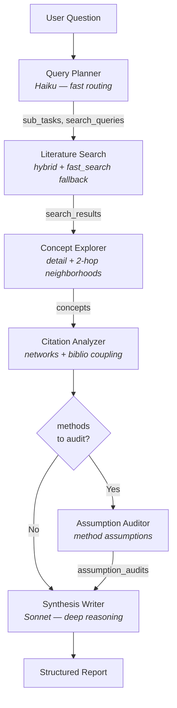
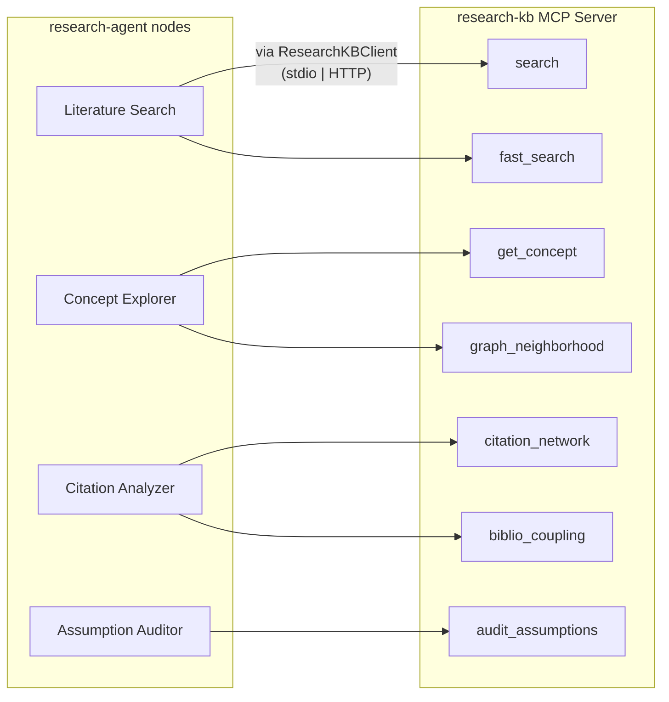

# research-agent

[](https://github.com/brandonmbehring-dev/research-agent/actions/workflows/ci.yml)
[](https://python.org)
[](LICENSE)
[](https://docs.astral.sh/ruff/)

Multi-agent research analysis system powered by [LangGraph](https://github.com/langchain-ai/langgraph) and the [Model Context Protocol (MCP)](https://modelcontextprotocol.io/).

Given a research question, the agent decomposes it into sub-tasks, searches a knowledge base, explores concept graphs, analyzes citation networks, audits method assumptions, and produces a structured synthesis report.

**Project History:** This repository is an open-source extraction of a multi-agent research workflow developed for internal use. It was modularized, upgraded with strict typing and evals, and published in February 2026 to demonstrate LangGraph + MCP orchestration patterns.

## Architecture

### Pipeline Flow



### MCP Tool Mapping



### Design Decisions

1. **LangGraph over CrewAI/Agent SDK** — Vendor-agnostic, fine-grained state control, conditional routing, proven in production across multiple personal projects.

2. **MCP integration over direct DB calls** — Standard protocol decouples the agent from the knowledge backend. research-kb can be swapped for any MCP-compatible source.

3. **Separate agent from knowledge base** — Single responsibility: agent orchestrates, KB serves knowledge. Services scale independently.

4. **Haiku for planning, Sonnet for synthesis** — Cost/latency optimization. Fast model for routing decisions, powerful model for final output quality.

5. **Pydantic BaseModel state** — Richer type support with defaults on every field, validation, and frozen immutability for sub-models. Each node returns a partial dict of updates — LangGraph merges automatically.

6. **Auditable Logic over Prompt Chaining** — Conditional routing ensures the LLM doesn't hallucinate methodological assumptions; it explicitly audits them against the knowledge graph. This provides a deterministic, verifiable research pipeline.

## Built on research-kb

This agent consumes [research-kb](https://github.com/brandonmbehring-dev/research-kb), a production knowledge base system I built with:

- **478 sources** in causal inference, time series, and RAG/LLM literature
- **307K+ concepts** in a knowledge graph with typed relationships
- **4-signal hybrid search**: BM25 full-text + BGE-large vectors + graph signals + PageRank citation authority
- **20 MCP tools** for search, concept exploration, citation analysis, and assumption auditing
- **~2,100+ tests** with comprehensive CI/CD

The agent uses 7 of these tools:

| Tool | Purpose |
|------|---------|
| `research_kb_search` | Hybrid search (BM25 + vector + graph + PageRank) |
| `research_kb_fast_search` | Lightweight vector-only fallback (~200ms) |
| `research_kb_get_concept` | Retrieve concept details from knowledge graph |
| `research_kb_graph_neighborhood` | Explore related concepts within N hops |
| `research_kb_citation_network` | Find citing/cited-by chains |
| `research_kb_biblio_coupling` | Related papers via shared reference overlap |
| `research_kb_audit_assumptions` | Method assumption documentation |

## Quickstart

### Prerequisites

- Python 3.11+
- [research-kb](https://github.com/brandonmbehring-dev/research-kb) cloned and set up locally
- Anthropic API key

### Installation

```bash
git clone https://github.com/brandonmbehring-dev/research-agent.git
cd research-agent

# Option A: uv (recommended — matches CI)
uv sync --extra dev

# Option B: pip
python -m venv venv
source venv/bin/activate
pip install -e ".[dev]"
```

### Configuration

```bash
cp .env.example .env
# Edit .env with your API key and research-kb path
```

**Environment variables:**

| Variable | Default | Description |
|----------|---------|-------------|
| `ANTHROPIC_API_KEY` | *(required)* | Anthropic API key |
| `MCP_TRANSPORT` | `stdio` | `stdio` (local) or `http` (Docker) |
| `RESEARCH_KB_PATH` | | Path to research-kb repo (stdio mode) |
| `RESEARCH_KB_URL` | `http://research-kb:8000` | HTTP endpoint (Docker mode) |
| `RESEARCH_KB_PYTHON` | | Python executable for stdio transport (default: `{RESEARCH_KB_PATH}/venv/bin/python`) |
| `MCP_PATH` | `/mcp` | MCP endpoint path appended to HTTP URL |
| `CACHE_ENABLED` | `true` | Enable SQLite report cache |
| `CACHE_DB_PATH` | `~/.cache/research-agent/cache.db` | Path to SQLite cache database |
| `CACHE_TTL_HOURS` | `24` | Hours before cached reports expire |

### Run

```bash
# CLI (stdio transport — spawns research-kb subprocess)
research-agent "What are the assumptions of double machine learning?"

# With verbose logging
research-agent -v "Compare DML and instrumental variables"

# Stream progress to stderr as nodes complete
research-agent --stream "What are the assumptions of DML?"

# Save report to file
research-agent -o report.md "How does cross-fitting reduce bias?"

# Bypass cache for a fresh run
research-agent --no-cache "What are the assumptions of DML?"

# Clear all cached reports
research-agent --clear-cache
```

### Docker (HTTP transport)

```bash
docker-compose up
# Agent connects to research-kb via HTTP at http://research-kb:8000/mcp
docker-compose run agent "Query here"
```

## Demo

[](https://asciinema.org/a/vYnTBEbzVoNd9zNs)

<details>
<summary>What happens in the demo</summary>

The agent receives "What are the assumptions of double machine learning?" and:
1. **Query Planner** (Haiku) decomposes it into 4-5 sub-tasks
2. **Literature Search** runs hybrid search across 478 sources (~12 results)
3. **Concept Explorer** traverses the knowledge graph (DML, Neyman orthogonality)
4. **Citation Analyzer** maps citation networks + bibliographic coupling
5. **Assumption Auditor** documents method assumptions from the KB
6. **Synthesis Writer** (Sonnet) produces a structured report with citations

Total time: ~3 minutes. Output: ~15K char report with 7 sections.
</details>

## Example Queries

The agent handles any research topic in the knowledge base. Examples:

```
"What are the assumptions of double machine learning?"
"Compare instrumental variables and regression discontinuity designs"
"How does cross-fitting reduce regularization bias in semiparametric estimation?"
"What methods exist for heterogeneous treatment effect estimation?"
"Explain the relationship between propensity scores and inverse probability weighting"
```

If results are sparse for a topic, the synthesis report honestly identifies gaps:

> *"2 sources found on [topic]. The knowledge base has deeper coverage on causal inference methods — consider refining the query to focus on [related area]."*

## Testing

```bash
# Unit tests (default, no env vars needed — all MCP calls mocked)
pytest tests/ -v --cov=research_agent --cov-fail-under=80

# Integration tests (requires live research-kb + API key)
RESEARCH_KB_PATH=~/Claude/research-kb ANTHROPIC_API_KEY=sk-... \
    pytest tests/ -m integration -v

# Evals (separate, LLM-as-judge — see docs/eval_baselines.md)
pytest evals/ -m eval --timeout=120 -v

# Run specific test module
pytest tests/test_nodes.py -v
```

## Project Structure

```
src/research_agent/
├── __init__.py
├── graph.py              # LangGraph StateGraph + conditional edges
├── state.py              # Pydantic state schema
├── config.py             # Model selection, MCP endpoint config
├── cache.py              # SQLite report cache (query hash + TTL)
├── mcp_client.py         # Thin wrapper calling research-kb MCP tools
├── cli.py                # CLI entry point
└── nodes/
    ├── query_planner.py      # Decomposes question into sub-tasks
    ├── literature_search.py  # Hybrid search with fallback
    ├── concept_explorer.py   # Knowledge graph traversal
    ├── citation_analyzer.py  # Citation networks + biblio coupling
    ├── assumption_auditor.py # Method assumption documentation
    └── synthesis.py          # Final structured report
```

## Eval Baselines

See [docs/eval_baselines.md](docs/eval_baselines.md) for LLM-as-judge scoring methodology, golden case definitions, and reproduction instructions.

## Roadmap

See [ROADMAP.md](ROADMAP.md) for planned improvements including architecture diagrams, persistent session memory, tool-call planning mode, and multi-KB routing.

## Development

```bash
# Install with dev dependencies
uv sync --extra dev

# Run tests
uv run pytest tests/ -v --cov=research_agent

# Lint + format
uv run ruff check src/ tests/
uv run ruff format src/ tests/

# Type check
uv run mypy src/
```

## License

MIT
